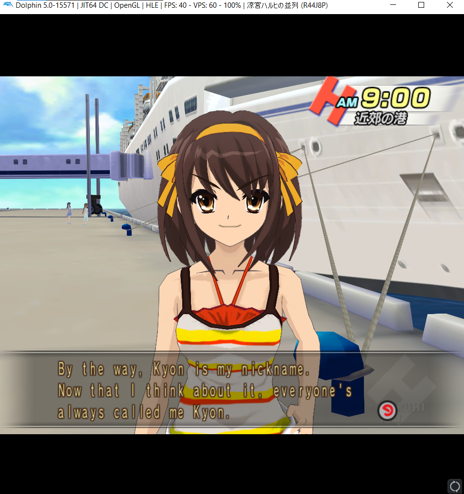
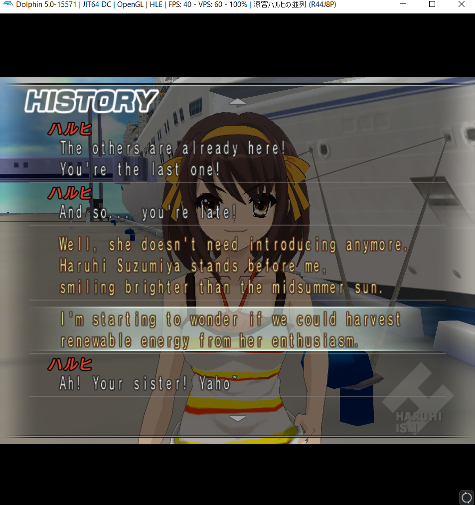

> **Update:** This project is now making use of [this tool](https://github.com/jonko0493/HaruhiHeiretsuEditor) instead.

# Suzumiya Haruhi no Heiretsu Translator
This tool allows for the editing and translating of **Suzumiya Haruhi no Heiretsu** (_Wii, 2009;_ EN: _The Parallel of Haruhi Suzumiya_) binary files that contain Japanese script data, to facilitate the production of an English patch.

## How to use
### Requirements
* Java 16
* An ISO disk image file of Suzumiya Haruhi no Heiretsu
  * See other tutorials for dumping Wii games to an ISO from disk. The game is still readily available on Amazon.co.jp
* [Kuriimu2](https://github.com/FanTranslatorsInternational/Kuriimu2) ([Download](https://github.com/FanTranslatorsInternational/Kuriimu2/releases))
* [Wiimm's ISO Tool](https://wit.wiimm.de/) ([Download](https://wit.wiimm.de/download.html))
* Suzumiya Haruhi no Heiretsu Translator ([Download](https://github.com/WiIIiam278/HaruhiHeiretsuTranslator/releases/))
* Dolphin emulator (5.0-15445+), or a hacked Wii (to play the game)
  * Older versions of Dolphin will have issues rendering text correctly.

### Extracting the disk image
1. Create a working directory and put your disk image file within it. Rename it to `HARUHI.iso`.
2. With wit installed and having restarted your system to ensure the system variables have been set, open command prompt and navigate (using `cd C:/foo/`) to your working directory. Then type `wit extract HARUHI.iso output`
3. Wait for wit to extract your disk image to the `~/output/` directory

### Extracting the BLN files
4. _Haruhi Heiretsu_ makes use of a file format known as BLN or "Shade", used in some other Wii games such as _Inazuma Eleven GO Strikers 2013_. Kuriimu has support for extracting and injecting this file format.
5. In your extracted disk image folder, navigate to `~/DATA/files/`. Copy `mcb1.bln` to a new subfolder in your working directory (not inside the extracted iso directory). Name it `mcb1` or something similar.
6. Open Kuriimu2 (it takes awhile to open), then click Tools > Batch Extractor. A prompt will be brought up asking you to select a few options. Input the following:
   1. Click the dropdown under plugins and scroll through them until you find `BLN`. Select this one
   2. Click "Select Input" and select the mcb1.bln file you just pasted into your new subdirectory.
   3. Click "Select Output". Create and select another new subdirectory within the one you previously made (`mcb1`), maybe call it `bln-extract`.
7. Click Execute. Kuriimu will now dump the game's archived file contents for you into two hundred and ninety-nine `.bin` files, in the `Sub BLN` format.
8. Now we need to extract these into Sub BLN files. Back on Kuriimu2, open up the Batch Extractor again.
   1. This time, select BLN SUB from the plugin dropdown.
   2. For the "Select Input", select the _folder_ containing the two hundred and ninety-nine `.bin` BLN Subs you just extracted (`bln-extract`).
   3. For the "Select Output", create another subfolder in your working directory, maybe `bln-sub-extract`
9. Click Execute and Kuriimu will work its magic again to extract the raw binary data files. This will take a few minutes. You will know when it's done because the "Execute" button will no longer be grayed out. It's worth quickly noting that Kuriimu will skip extracting some Sub BLN files that do not contain any archive data, so there will be gaps, which is expected behaviour.
10. Check that the extraction is complete. Kuriimu will have placed each extracted Sub BLN inside its own folder named after the file it was extracted from. In your `bln-sub-extract` folder, you should have files numbered 0.bin to 297.bin (with some gaps, as mentioned).

### Editing files with the translator tool
11. Open the Haruhi Heiretsu Translator executable. Select Open to open a file and navigate to your `bln-sub-extract` folder.
12. _Haruhi Heiretsu_ translatable scripts are stored from Sub BLN folders 75.bin to 297.bin. Specifically, within these extracted Sub BLN folders, it's the 3.bin file that contains the data to modify.
13. To easily test that it works, use the `Open...` button to open 75.bin which contains the opening character dialogue with Haruhi. You may wish to resize the window to make it easier to use.
14. You can now read, edit & replace lines of text. There are a few important things to note:
    1. In addition to the Japanese text, script files contain header data, voice line identifiers and dialogue control codes (flags that how fast text scrolls, etc.). However, editing these may break the game, so stick with the Japanese text. 
    2. Only characters available to use in the SHIFT-JIS encoding (which is what the game uses) [are supported](https://uic.io/en/charset/show/cp932/). Additionally, the + character is not supported, because...
    3. New lines/Carriage returns in dialogue are represented with a + character in this tool.
    4. Each line of dialogue has a maximum byte length. The Japanese script uses all the bytes to represent text. It's currently not feasible to extend the length of text lines or add new ones due to how the game reads and verifies byte lengths, however this is not a big problem as latin characters in SHIFT-JIS only occupy one byte compared to Japanese characters requiring two. It still may require some creativity and concise translation in places, unfortunately, though.
15. The editor display contains the file you are viewing at the top and at the bottom is displayed the current line number you are on (counting from 0), as well as the number of bytes on that line out of the byte limit for that line.
    1. If you're editing the 3.bin within Sub BLN 75 (which contains the first dialogue segment), line 25 contains the first dialogue line spoken by Haruhi. You could try editing this line and replace it with its english translation: `Late! You're late, Kyon! Penalty!`.
16. Once you have made your modifications, click `Save As...` to save your modified patch file. Save it in your working directory.
    1. If your file contains lines that exceed the byte limit, an error box will appear telling you which lines you need to shorten.

### Injecting modified files
17. Now we're going to inject your modified file back into the MCB file we got it from, so that we can recompose the ISO. 
18. Open Kuriimu2. Select File > Open. Navigate to the `~/DATA/files/` in the file opener and select `mcb0.bln`.
19. You will be prompted with a screen which states that Kuriimu "Could not automatically determine plugin for opening this file...". Look for `plugin_shade.dll` and click the dropdown. Select `BLN (Archive in Inazuma Eleven GO Strikers 2013)` and click Continue.
20. Find the BLN Sub containing the modified file you wish to inject and double-click on it, which will open its contents in a new tab.
21. Find the BIN file you previously opened in the Translator tool. Right click on it and select "Replace". Then navigate to the file you saved with the Translator tool.
22. Once the file has been replaced, don't forget to save it! Click the save icon in the top left corner, then make sure you save the parent BLN file too by clicking on that tab and pressing the save button as well. Unsaved files are marked with an asterisk in Kuriimu2.

### Recomposing the disk imag
23. Now that you've replaced your file, you can recompose the ISO image. Open up command line again and navigate to your working directory.
24. Type `wit copy output HARUHI-PATCHED.iso --verbose --verbose` to copy the file (2x `--verbose` arguments means wit will give you some feedback showing the progress).
25. Once wit is complete, your modified ISO file will be output as `HARUHI-PATCHED.iso`

### (Optional) Playing on Dolphin
26. Open the ISO with Dolphin. Ensure that you are running the latest stable "beta" version of Dolphin or are at least v5.0-15445 and above. Earlier versions of dolphin contain incorrect configuration data for _Haruhi Heiretsu_ caused by an overly aggressive texture caching option being set, meaning in-game text characters [will randomly disappear](https://bugs.dolphin-emu.org/issues/12722).
    1. If you edited 75.bin and want to see your results, start a new game, then skip the intro cutscene (PLUS button) and select then press the A button to start the dialogue with Haruhi.
    2. If you get an Invalid Read error in Dolphin when loading your patched ISO, you've done something wrong - make sure you read the "important things" above about how the game stores text.

## Features
* Open, edit and save game dialogue files (.bin)
* Search game dialogue files for text

## To-do
* Event scene (cutscene) format analysis and then let this tool open and edit them
* More research into misc stuff that needs translating:
  * Menu text
  * Character names
  * Clubroom mode dialogue
  * Graphics in some places if needed (Haruhi has its own weird version of the SHTX image format used in Shade games)
* A bit more automation (i.e. let the tool open mcb files directly, maybe even have a tool that runs wit to extract the disk)

### End goal
As mentioned, the objective is to create a similar application to this that automatically extracts an ISO with wit, extracts the bln directories directly without need for Kuriimu, patches the Japanese binary files with English ones created with this tool and then uses wit to recompose the ISO disk image once again.

Tl;dr: Use this to make an english patch and then make an english patcher tool.

## Building this tool
This tool is built with maven using IntelliJ IDEA's GUI builder. IntelliJ IDEA (Community or Ultimate) 2020.2 is recommended as a result.

To build, import it into IntelliJ and create a maven configuration with `clean package` command line arguments. Run it and it should build.